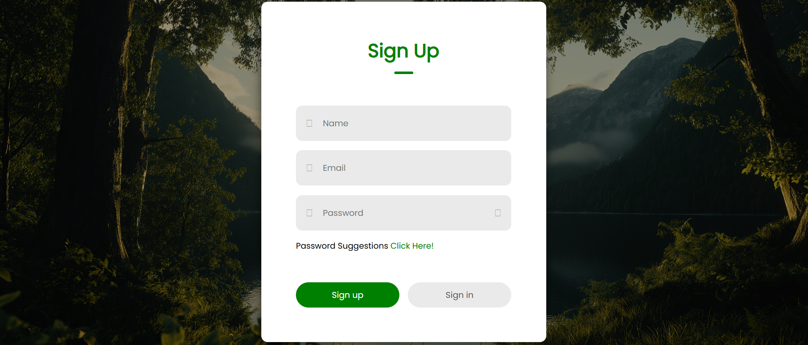
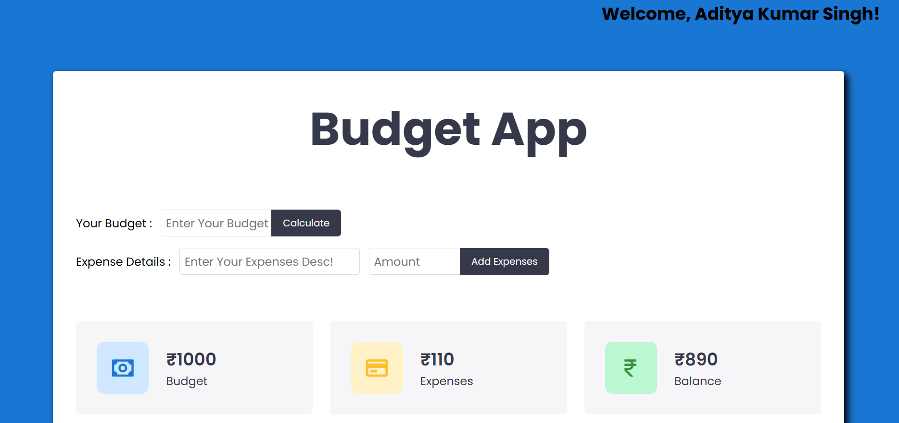
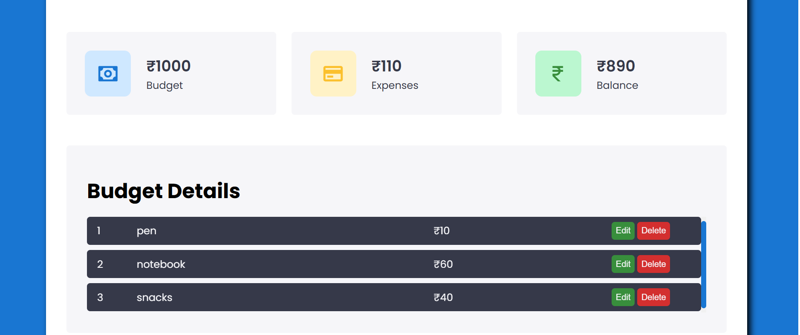

# 💰 Expense Tracker / Budget App

A simple and responsive web application that helps users track their budget, expenses, and remaining balance.  
The app supports user authentication and stores all budget/expense details securely using **MongoDB Atlas** and **Mongoose**.  
Frontend is built with **HTML, CSS, JavaScript**, while the backend API is powered by **Node.js + Express.js**.

---

## 📸 Screenshots

 
  

---

## 🔥 Features

- User authentication (Login / Signup)
- Add budget amount
- Add expenses with description & amount
- Automatically calculate:
  - Total Budget  
  - Total Expenses  
  - Remaining Balance  
- Edit & delete expense entries
- Clean, responsive, and user-friendly UI
- Data stored in MongoDB Atlas (Cloud Database)
- Backend built with REST API architecture

---

## 🛠️ Tech Stack

### **Frontend**
- HTML  
- CSS  
- JavaScript  

### **Backend**
- Node.js  
- Express.js  
- MongoDB Atlas  
- Mongoose  

---

